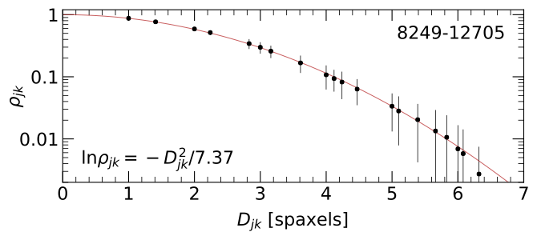
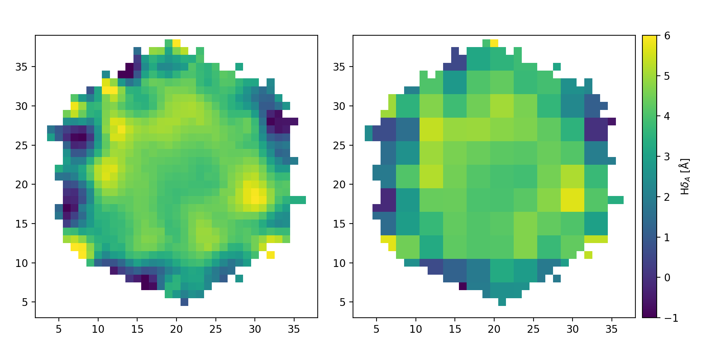
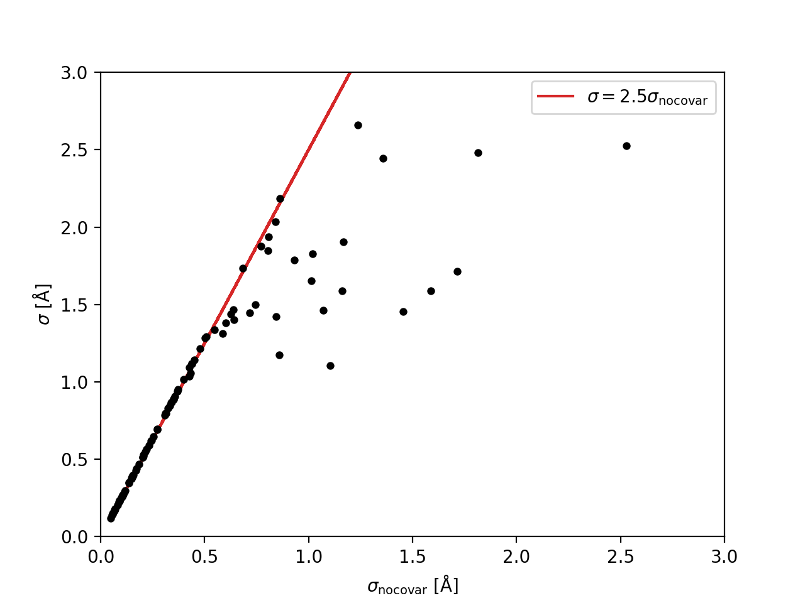

.. |ang|   unicode:: U+212B

.. include:: include/links.rst

.. _aggregation:

Map Aggregation and Modeling
============================

It is important to appreciate that the MaNGA datacubes exhibit
significant spatial covariance between spaxels. For example, this is
a critical consideration when binning spaxels to an expected S/N
threshold; see Section 6 from `Westfall et al. (2019, AJ, 158, 231)`_.

The output quantities provided by the DAP are, therefore, also
spatially correlated. **The detailed calculation of covariance
matrices for DAP quantities requires simulations that have not been
performed!** Having said that, some initial testing along these lines
suggests that the correlation matrix of DAP quantities can be
approximated by the nominal correlation between quantities in any
given DRP wavelength channel.

.. warning::

    The suggestions below are provided on a **shared-risk** basis,
    pending a more robust series of tests to validate this approach.
    **Use with caution.**

----

Approximate Correlation Between Spaxels
---------------------------------------

In Section 6.2 of `Westfall et al. (2019, AJ, 158, 231)`_, we showed
that the correlation, :math:`\rho`, between spaxels as a function of
the distance between them is well approximated by a Gaussian
function.

   Figure 8 from `Westfall et al. (2019, AJ, 158, 231)`_: The mean
   (points) and standard deviation (errorbars) of the correlation
   coefficient, :math:`\rho_{jk}`, for all spaxels within the convex
   hull of the fiber-observation centers at channel 1132
   (:math:`\lambda` = 4700 |ang|) of datacube 8249-12705 as a
   function of the spaxel separation, :math:`D_{jk}`. The
   best-fitting Gaussian trend (red) has a scale parameter of
   :math:`\sigma` = 1.92 spaxels, leading to the equation provided in
   the bottom-left corner.

You can construct the approximate correlation matrix for a given data
cube as follows (cf. :ref:`spatialcovariance`; :ref:`covariance`):

.. code-block:: python

    from mangadap.datacube import MaNGADataCube
    C = MaNGADataCube.from_plateifu(7815, 3702).approximate_correlation_matrix()

Initial tests suggest this correlation matrix is a good approximation
for the DAP maps.

----

Approximate Covariance in a DAP Map
-----------------------------------    

To construct the covariance matrix for a DAP map, start with the
approximate correlation matrix and then renormalize to a covariance
matrix using the provided variance data. For example, the following
code constructs the covariance matrix in the :math:`{\rm H}\alpha`
velocity measurements (note that the transposes are **important**;
unfortunately, construction of the approximate correlation requires
the instantation of the
:class:`~mangadap.datacube.manga.MaNGADataCube`):

.. code-block:: python

    # Imports
    import numpy
    from astropy.io import fits
    from mangadap.datacube import MaNGADataCube
    from mangadap.dapfits import DAPMapsBitMask
    from mangadap.util.fileio import channel_dictionary

    # Read the datacube (assumes the default paths)
    cube = MaNGADataCube.from_plateifu(7815, 3702)

    # Construct the approximate correlation matrix
    C = cube.approximate_correlation_matrix(rho_tol=0.01)

    # Read the MAPS file
    hdu = fits.open('manga-7815-3702-MAPS-HYB10-MILESHC-MASTARHC2.fits.gz')

    # Get a dictionary with the emission-line names
    emlc = channel_dictionary(hdu, 'EMLINE_GFLUX')

    # Save the masked H-alpha velocity and velocity variance
    bm = DAPMapsBitMask()
    vel = numpy.ma.MaskedArray(hdu['EMLINE_GVEL'].data[emlc['Ha-6564'],...],
                               mask=bm.flagged(hdu['EMLINE_GVEL_MASK'].data[emlc['Ha-6564'],...],
                                               flag='DONOTUSE')).T
    vel_var = numpy.ma.power(hdu['EMLINE_GVEL_IVAR'].data[emlc['Ha-6564'],...].T, -1)
    vel_var[vel.mask] = numpy.ma.masked

    # Construct the approximate covariance matrix
    vel_C = C.apply_new_variance(vel_var.filled(0.0).ravel())
    vel_C.revert_correlation()

----

2D Modeling of a DAP Map
------------------------

When constructing a 2D model of the quantities in a DAP map, ideally
you would account for the covariance between spaxels in the
formulation of the optimized figure-of-merit. For example, with the
covariance matrix, :math:`{\mathbf \Sigma}`, the chi-square statistic
is written as a matrix multiplication:

.. math::

    \chi^2 = {\mathbf \Delta}^{\rm T} {\mathbf \Sigma}^{-1} {\mathbf \Delta},

where :math:`{\mathbf \Sigma}^{-1}` is the inverse covariance matrix
and :math:`{\mathbf \Delta} = {\mathbf d} - {\mathbf m}` is the
vector of residuals between the observed data, :math:`{\mathbf d}`,
and the proposed model data, :math:`{\mathbf m}`.

To fit a model then, we need to calculate the inverse of the
covariance matrix. A minor complication in doing this for the DAP
maps is that covariance matrix of the full map is *always* singular
because of the empty regions in the map with no data. Taking care to
keep track of original on-sky coordinates of each spaxel, we need to
remove the empty regions of the map from the covariance matrix before
inverting it. Continuing from the code above and assuming the masks
for ``vel`` and ``vel_var`` mask out all spaxels without valid data:

.. code-block:: python

    # Flatten the map and get a vector that selects the valid data
    vel = vel.ravel()
    indx = numpy.logical_not(numpy.ma.getmaskarray(vel))

    # Pull out only the valid data
    _vel = vel.compressed()
    _vel_C = vel_C.toarray()[numpy.ix_(indx,indx)]

    # Get the inverse covariance data
    _vel_IC = numpy.linalg.inv(_vel_C)

Assuming you have a vector with the model velocities (``model_vel``),
you would then calculate :math:`\chi^2` using the above matrix
multiplication. Just for the purpose of illustration let's set the
model values to be 0 everywhere:

.. code-block:: python

    # Calculate chi-square
    model_vel = numpy.zeros(_vel.size, dtype=float)
    delt = _vel - model_vel
    chisqr = numpy.dot(delt, numpy.dot(_vel_IC, delt))

.. warning::

    Note that *by definition* :math:`\chi^2` must be positive.
    However, a combination of the inaccuracies of the correlation
    approximation and numerical error in the inversion of the
    covariance matrix means that this would not necessarily be true
    in the example above. This is why I limited the construction of
    the approximate correlation matrix to require :math:`\rho \geq
    0.01`; see
    :func:`~mangadap.datacube.datacube.DataCube.approximate_correlation_matrix`.
    This is needed to ensure the calculation of ``chisqr`` above is
    positive, at least in the example case above.

----

Aggregation of Mapped Quantities
--------------------------------

When aggregating data within a map, like summing within an aperture
or calculating the mean within a region, propagation of the error
aggregated quantity should account for spatial covariance. The
easiest way to deal with the error propagation is to recast the
aggregation as a matrix multiplication. The following is a worked
example for binning the :math:`{\rm H}\delta_{\rm A}` index.

.. warning::

    This example works with the *uncorrected* :math:`{\rm
    H}\delta_{\rm A}` index!

To start, here are the top-level imports:

.. code-block:: python

    # Imports
    from IPython import embed
    import numpy
    from matplotlib import pyplot
    from astropy.io import fits
    from mangadap.datacube import MaNGADataCube
    from mangadap.dapfits import DAPMapsBitMask
    from mangadap.util.fileio import channel_dictionary
    from mangadap.util.covariance import Covariance
    from mangadap.util.fitsutil import DAPFitsUtil

Get the data
~~~~~~~~~~~~

First, we extract the data, the weights needed to get the mean index,
and the approximate covariance matrix. This is all very similar to
what's done to get the velocity measurements above:

.. code-block:: python

    # Read the datacube (assumes the default paths)
    cube = MaNGADataCube.from_plateifu(7815, 3702)

    # Construct the approximate correlation matrix
    C = cube.approximate_correlation_matrix()

    # Read the MAPS file
    hdu = fits.open('manga-7815-3702-MAPS-HYB10-MILESHC-MASTARHC2.fits.gz')

    # Get a dictionary with the spectral index names
    ic = channel_dictionary(hdu, 'SPECINDEX_BF')

    # Extract the masked HDeltaA index, its variance, and the relevant weight
    bm = DAPMapsBitMask()
    hda = numpy.ma.MaskedArray(hdu['SPECINDEX_BF'].data[ic['HDeltaA'],...],
                               mask=bm.flagged(hdu['SPECINDEX_BF_MASK'].data[ic['HDeltaA'],...],
                                               flag='DONOTUSE')).T
    hda_wgt = numpy.ma.MaskedArray(hdu['SPECINDEX_WGT'].data[ic['HDeltaA'],...],
                                   mask=bm.flagged(hdu['SPECINDEX_WGT_MASK'].data[ic['HDeltaA'],...],
                                                   flag='DONOTUSE')).T
    hda_var = numpy.ma.power(hdu['SPECINDEX_BF_IVAR'].data[ic['HDeltaA'],...].T, -1)

    # Unify the masks (just in case they aren't already)
    mask = numpy.ma.getmaskarray(hda) | numpy.ma.getmaskarray(hda_wgt) | numpy.ma.getmaskarray(hda_var)
    hda[mask] = numpy.ma.masked
    hda_wgt[mask] = numpy.ma.masked
    hda_var[mask] = numpy.ma.masked

    # Construct the approximate covariance matrix
    hda_C = C.apply_new_variance(hda_var.filled(0.0).ravel())
    hda_C.revert_correlation()

Construct a binning map
~~~~~~~~~~~~~~~~~~~~~~~

Just for demonstration purposes, we need to create a map that
identifies the spaxels that will be aggregated. The following just
constructs a rough, ad hoc binning scheme, with bins of roughly 3x3
spaxels:

.. code-block:: python

    def boxcar_replicate(arr, boxcar):
        """
        Boxcar replicate an array.

        Args:
            arr (`numpy.ndarray`_):
                Array to replicate.
            boxcar (:obj:`int`, :obj:`tuple`):
                Integer number of times to replicate each pixel. If a
                single integer, all axes are replicated the same number
                of times. If a :obj:`tuple`, the integer is defined
                separately for each array axis; length of tuple must
                match the number of array dimensions.

        Returns:
            `numpy.ndarray`_: The block-replicated array.
        """
        # Check and configure the input
        _boxcar = (boxcar,)*arr.ndim if isinstance(boxcar, int) else boxcar
        if not isinstance(_boxcar, tuple):
            raise TypeError('Input `boxcar` must be an integer or a tuple.')
        if len(_boxcar) != arr.ndim:
            raise ValueError('Must provide an integer, or a tuple with one number per array dimension.')

        # Perform the boxcar average over each axis and return the result
        _arr = arr.copy()
        for axis, box in zip(range(arr.ndim), _boxcar):
            _arr = numpy.repeat(_arr, box, axis=axis)
        return _arr

    # Construct a binning array that bins all the data into 3x3 bins, with
    # the bins roughly centered on the center of the map
    nbox = 3
    nmap = hda.shape[0]
    nbase = nmap//nbox + 1
    s = nbox//2
    base_bin_id = numpy.arange(numpy.square(nbase)).reshape(nbase, nbase).astype(int)
    bin_id = boxcar_replicate(base_bin_id, nbox)[s:s+nmap,s:s+nmap]

    # Ignore masked pixels and reorder the bin numbers
    bin_id[hda.mask] = -1
    unique, reconstruct = numpy.unique(bin_id, return_inverse=True)
    bin_id = numpy.append(-1, numpy.arange(len(unique)-1))[reconstruct]

Bin the data
~~~~~~~~~~~~

By identifying which spaxels are in each bin, we can now construct
the weighting matrix, bin the data, and get the covariance matrix of
the binned data:

.. code-block:: python

    # Construct the weighting matrix
    nbin = numpy.amax(bin_id)+1
    nspax = numpy.prod(hda.shape)
    wgt = numpy.zeros((nbin, nspax), dtype=float)
    indx = numpy.logical_not(hda.mask.ravel())
    wgt[bin_id[indx],numpy.arange(nspax)[indx]] = hda_wgt.data.ravel()[indx]
    sumw = numpy.sum(wgt, axis=1) 
    wgt *= ((sumw != 0)/(sumw + (sumw == 0)))[:,None]

    # Get the binned data and its covariance array
    bin_hda = numpy.dot(wgt, hda.ravel())
    bin_hda_C = Covariance.from_matrix_multiplication(wgt, hda_C.full())

We can then use
:func:`~mangadap.util.fitsutil.DAPFitsUtil.reconstruct_map` to
construct a map of the binned data with the same format as the
original spaxel data, and create a plot that shows the two
side-by-side:

.. code-block:: python

    # Reconstruct a map with the binned data
    bin_hda_map = numpy.ma.MaskedArray(DAPFitsUtil.reconstruct_map(hda.shape, bin_id.ravel(), bin_hda),
                                       mask=bin_id == -1)

    # Compare the unbinned and binned maps
    w,h = pyplot.figaspect(1)
    fig = pyplot.figure(figsize=(2*w,h))

    ax = fig.add_axes([0.05, 0.1, 0.4, 0.8])
    ax.set_xlim([2,38])
    ax.set_ylim([3,39])
    ax.imshow(hda, origin='lower', interpolation='nearest', vmin=-1, vmax=6)

    ax = fig.add_axes([0.5, 0.1, 0.4, 0.8])
    ax.set_xlim([2,38])
    ax.set_ylim([3,39])
    img = ax.imshow(bin_hda_map, origin='lower', interpolation='nearest', vmin=-1, vmax=6)
    cax = fig.add_axes([0.91, 0.1, 0.02, 0.8])
    cax.text(3., 0.5, r'H$\delta_A$ [${\rm \AA}$]', ha='center', va='center', transform=cax.transAxes,
             rotation='vertical')
    pyplot.colorbar(img, cax=cax)
    pyplot.show()

   Comparison of the original :math:`{\rm H}\delta_A` map (left) with
   the result of binning the data in roughly 3x3 spaxel bins (right).

We can also compare the errors that we would have calculated without
any knowledge of the covariance to the errors calculated using the
approximate correlation matrix:

.. code-block:: python

    # Compare the errors with and without covariance
    bad_var = numpy.dot(numpy.square(wgt), hda_var.ravel())
    good_var = numpy.diagonal(bin_hda_C.toarray())

    bad_sig = numpy.sqrt(bad_var)
    pyplot.plot(bad_sig, 2.5*bad_sig, color='C3', zorder=1,
                label=r'$\sigma = 2.5 \sigma_{\rm no covar}$')
    pyplot.scatter(bad_sig, numpy.sqrt(good_var), marker='.', s=80, color='k', lw=0, zorder=2)
    pyplot.xlim([0,3])
    pyplot.ylim([0,3])
    pyplot.xlabel(r'$\sigma_{\rm no covar}$ [${\rm \AA}$]')
    pyplot.ylabel(r'$\sigma$ [${\rm \AA}$]')
    pyplot.legend()
    pyplot.show()

   Comparison of the errors in the binned :math:`{\rm H}\delta_A`
   measurements without considering the covariance,
   :math:`\sigma_{\rm no covar}`, to the values that include the
   approximation of the covariance matrix, :math:`\sigma`. The red
   line shows that the errors that ignore covariance are
   underestimated by a factor of ~2.5.
