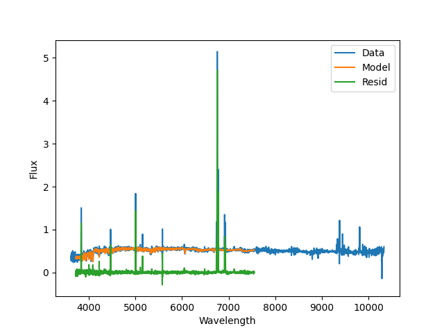
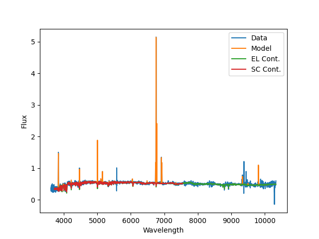
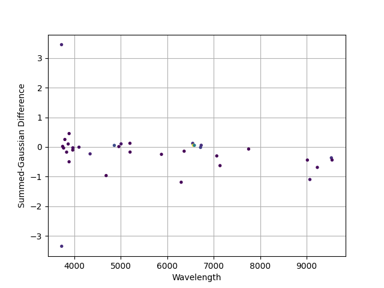

.. include:: include/links.rst

.. _fitonespec:

How to Fit One Spectrum
=======================

The low-level functions in the DAP treat each spectrum independently.  As such,
it's possible to use these functions to effectively fit any spectrum you like.
Here, we guide you through the example script in `examples/fit_one_spec.py
<https://github.com/sdss/mangadap/blob/master/examples/fit_one_spec.py>`_.  Note
this isn't an abstracted executable included in the package distribution, but is
meant to be something you use as a starting point for your own script.  There is
additional guidance in the comments of the script itself that is not replicated
here.

Workflow Overview
-----------------

The script performs the following steps:

    #. Load the spectrum to fit.

    #. Define the keywords used by the DAP to establish how the data will be
       analyzed.

    #. Fit the stellar continuum using :class:`~mangadap.proc.ppxffit.PPXFFit`,
       primarily to measure the stellar kinematics.  Show the result if
       requested.

    #. Measure non-parametric moments of the spectrum in windows at the expected
       locations of a set of emission lines.  This analysis is done on the
       observed spectra after subtracting the best-fitting continuum determined
       in step 3.

    #. Simultaneously fit the stellar continuum (with the kinematics fixed from
       step 3) and single-Gaussian profiles for the emission lines.  Show the
       result, if requested.

    #. Re-measure the non-parametric emission-line moments with the updated
       redshift and best-fitting stellar continuum, and show a plot comparing
       the Gaussian fitted and non-parametric fluxes.

    #. If any were defined, measure a set of spectral indices.  This includes a
       computation and application of velocity dispersion corrections.  Print
       the resulting measurements for a few indices.

Execution details and user flexibility
--------------------------------------

The low-level functions used in the script are very general; however, there are
still a few expectations for the input.

    #. The spectra to be fit must be geometrically binned in wavelength (e.g.,
       spectral channels have a constant with in ``log(lambda)``).  If you're
       input spectrum has linear wavelength steps, you can use the
       :class:`~mangadap.util.sampling.Resample` class to resample your data.
       This comes with all the relevant caveats about how this resampling will
       affect the spectral noise properties.  See :ref:`resampling`.

    #. All error analysis in the DAP currently assumes the provided spectral
       flux error vectors are accurate, and there is currently no treatment of
       spectral covariance.  If the error estimates for your spectra are
       systematically in error, so too will be the errors returned for the
       provided measurements.

    #. You must have an estimate of the redshift that is within :math:`\pm 2000`
       km/s of the true value.  This is driven by the bounds imposed by `ppxf`_,
       which cannot yet be altered without digging deep into the DAP code.  The
       inputs also accept a guess for the velocity dispersion, but this has very
       little, if any, affect on the best-fitting result.

    #. The quality of the velocity dispersion measurements critically depend on
       the estimates of the spectral resolution in your data.  However, this is
       mostly a statement about the accuracy of the velocity dispersion
       corrections.  If you're unsure of the spectral resolution of your data,
       do *not* trust the velocity dispersion corrections provided.

    #. Masking is performed in two ways: (1) The spectra can have pixel-by-pixel
       masks the exclude these data from *any* analysis step.  These masks are
       for regions, e.g., affected by poor sky subtraction.  (2) Specific
       regions can be masked during the full-spectral-fitting modules
       (:class:`~mangadap.proc.ppxffit.PPXFFit` and
       :class:`~mangadap.proc.sasuke.Sasuke`).  In the example script, these are
       defined using the :class:`~mangadap.util.pixelmask.SpectralPixelMask`
       class.  The class accepts database files that indicate regions affected
       by artifacts, emission lines that should be ignored during the stellar
       continuum fit, or the ability to restrict the fit to a fixed rest
       wavelength.  In the example script, the 5577 sky line is masked as having
       been poorly subtracted and all emission lines in the ``ELPMPL11``
       database are masked.

    #. The templates used during the spectral fitting functions,
       :class:`~mangadap.proc.ppxffit.PPXFFit` for the stellar kinematics and 
       :class:`~mangadap.proc.sasuke.Sasuke` for the emission-line modeling, are
       set via keywords.  Descriptions of the available options and how to use
       custom template libraries are described here: :ref:`templatelibraries`.

    #. The databases used for the non-parametric emission-line moments and the
       emission-line Gaussian modeling are set via separate keywords.
       Descriptions of the available options and how to use custom emission-line
       sets are described here: :ref:`emissionlines`.

    #. The databases used to define the spectral indices used are defined
       separately for absorption-line indices --- i.e., indices measuring the EW
       of an absorption feature relative to the continuum --- and "bandhead" or
       "color" indices --- i.e., indices measured by comparing the continuum
       level in two adjacent sidebands.  Descriptions of the available options
       and how to use custom index sets are described here:
       :ref:`spectralindices`.

Analysis Results
----------------

Currently the script does not save any of the results of the fit.  You're
encouraged to use `IPython.embed`_ to spawn an ipython session at the end of the
script (but within the ``main`` function) to interact with the objects
containing the results.  If you place an ``embed()`` statement just before the
last print statement in the ``main`` function, you can do the following (after
executing ``python fit_one_spec.py`` on the command line):

.. code-block:: ipython

    In [1]: cont_par.dtype.names
    Out[1]:
    ('BINID',
    'BINID_INDEX',
    'MASK',
    'BEGPIX',
    'ENDPIX',
    'NPIXTOT',
    'NPIXFIT',
    'TPLWGT',
    'TPLWGTERR',
    'USETPL',
    'ADDCOEF',
    'MULTCOEF',
    'KININP',
    'KIN',
    'KINERR',
    'CHI2',
    'RCHI2',
    'CHIGRW',
    'RMS',
    'RMSGRW',
    'FRMS',
    'FRMSGRW',
    'SIGMACORR_SRES',
    'SIGMACORR_EMP')

    In [2]: cont_par["KIN"]
    Out[2]: array([[ 8754.982579  ,    68.85966735]])

    In [3]: cont_par["TPLWGT"]
    Out[3]:
    array([[ 0.00140314,  0.        ,  0.        ,  0.        ,  0.        ,
            0.        ,  0.        ,  0.        ,  0.        ,  0.        ,
            0.        ,  0.        ,  0.00579377,  0.00402099,  0.01253188,
            0.        ,  0.00626336,  0.        ,  0.01588571,  0.        ,
            0.10398248,  0.        ,  0.        ,  0.        ,  0.00147509,
            0.        ,  0.04152064,  0.00120283,  0.        ,  0.00409837,
            0.00670623,  0.        ,  0.03013952,  0.        ,  0.        ,
            0.        ,  0.        ,  0.00532783,  0.12609806,  0.01856902,
            0.00477959,  0.        ]])

Examining the Results
---------------------

The script creates three plots and provides a table with a few of the measured Lick indices:

   A plot of the stellar continuum fit produced by
   :class:`~mangadap.proc.ppxffit.PPXFFit`; blue is the data, orange is the best
   fit model, and green are the residuals.  Note that the emission lines are
   masked during this fit, and the model spectral range is limited by the MILES
   templates used during the fit.

   A plot of the emission-line modeling fit produced by
   :class:`~mangadap.proc.sasuke.Sasuke`; blue is the data, orange is the best
   fit model, green is the stellar-continuum only, and red is the stellar
   continuum from the stellar kinematics fit.  Note that continuum using during
   the emission-line module (from MaStar) span (nearly) the full MaNGA spectral
   range.

   A comparison of the fluxes measured using the non-parametric (summed)
   approach versus the Gaussian modeling.  Point colors are from the "viridis"
   color map, with purple having low fluxes through green and then yellow with
   higher fluxes (difficult to see from the figure).  Differences are larger at
   low flux and in the NIR where sky subtraction residuals can be significant.

The block below shows the table of index measurements printed by the script.

.. code-block:: console

    -------------------------------------------------------------------------
    NAME        Raw Index          err   Index Corr        Index          err
    -------- ------------ ------------ ------------ ------------ ------------
    Hb             3.9815       0.1776       1.0045       3.9995       0.1784
    HDeltaA        4.4995       0.2370       1.0001       4.4998       0.2370
    Mgb            2.2928       0.1669       0.9993       2.2912       0.1667
    Dn4000         1.2802       0.0085       1.0003       1.2806       0.0085
    -------------------------------------------------------------------------

Problems?
---------

If you have problems, particularly those that you think may be a more general
problem, please `Submit an issue`_.

