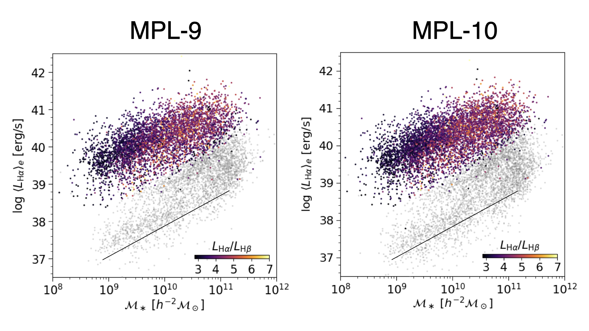

.. include:: include/links.rst

****************
DAP Known Issues
****************

Persistent
==========

LSF limitations
---------------

The DRP provides both pre- and post-pixelized Gaussian measurements of the
instrumental line-spread function. Because it makes the most sense to use the
pre-pixelized versions with pPXF, the DAP uses these pre-pixelized
measurements for the dispersion calculations in both the stellar and
ionized-gas velocity dispersions. See `Law et al. (2021, AJ, 161, 52)`_ for
an in-depth analysis of the affects of the LSF measurements on the stellar
and ionized-gas velocity dispersions.

Artifact effects on emission-line fitting
-----------------------------------------

The DRP will inevitably miss some cosmic rays, and occasionally those
cosmic rays will land on or near emission lines.  This will play havoc
with the emission-line fitter.  Beyond possibly affecting the flux of
the nearest line, it can also pull off *all* of the lines because the
lines are forced to have the same velocity.  An example of this in
MPL-7/DR15 is ``8134-9102`` where a cosmic ray lands on [S II]6718 for
e.g., spaxel (x,y) = (25,35).  The cosmic-ray is slightly blueward of
the [S II] center and leads to all the remaining lines being too far to
the blue, as well as leading to incorrect fluxes and velocity
dispersions.

Spectral indices
----------------

Both the spectral indices and their velocity-dispersion corrections are
measured using the input (NSA) redshift, *not* the fitted stellar
velocity.  Specifically for the velocity-dispersion corrections, this
means that there will be a *velocity* dependence of the correction that
can be more significant that the correction for the velocity dispersion
itself.

Flagging
--------

There are still deficiencies in flagging, in general. Measurements can
exhibit pixel-to-pixel variations that are inconsistent with random error
(because of the strong covariance between neighboring spaxels) or fiber-level
deviations that are inconsistent with physical intuition. These issues tend
to occur at low S/N, however, they might not all be caught by a simple S/N
cut. **Please consider the limited robustness of the flagging for your
science goals.** These limitations apply to essentially all derived products
(kinematics, fluxes, indices, etc).

Uncertainties
-------------

Errors are generally "formal" errors determined either by the covariance
(inverse Hessian) matrix provided by the optimization algorithm (stellar and
emission-line kinematics; `ppxf`_) or a direct propagation of the error based
on the inverse variances provided by the DRP (as for the emission-line
moments and spectral indices). Idealized experiments and analysis of repeat
observations have shown that the formal errors are generally within a factor
of two of the statistical error. See the detailed assessments of the DAP
uncertainties in the two main DAP papers: `Westfall et al. (2019, AJ, 158,
231)`_ and `Belfiore et al. (2019, AJ, 158, 160)`_.

MPL-11 (3.1.0)
==============

Faults
------

The full report of the observations that faulted and the consolidated
list of error messages can be found in the `MPL-11 error report`_
(internal).

In total, there are 11273 DRP-produced data cubes. Of these, 491 did
not have an input redshift, and were therefore not analyzed by the
DAP; most (if not all) of these are the result of allocating bundles
to empty sky for special observations (such as the mosaic of IC342).

Of the 10782 cubes that the DAP attempted to analyze, 47 caused
faults during the analysis. These failures are mostly because the S/N
required for either the stellar kinematics or emission-line fit was
insufficient for *any* spectrum in the datacube. Of these, two cubes
successfully finished the ``SPX-MILESHC-MASTARSSP`` analysis, but
were unsuccessful for the other three types. Here are the
number of completed ``MAPS`` files for each ``DAPTYPE``:

+-----------------------------+-----------------------+
|                 ``DAPTYPE`` | :math:`N_{\rm cubes}` |
+=============================+=======================+
|  ``SPX-MILESHC-MASTARSSP``  |                 10737 |
+-----------------------------+-----------------------+
| ``VOR10-MILESHC-MASTARSSP`` |                 10735 |
+-----------------------------+-----------------------+
| ``HYB10-MILESHC-MASTARSSP`` |                 10735 |
+-----------------------------+-----------------------+
| ``HYB10-MILESHC-MASTARHC2`` |                 10735 |
+-----------------------------+-----------------------+

The 41 cubes that failed all ``DAPTYPEs`` are::

    8312-6101, 8479-6101, 8479-6102, 8479-12703, 8480-6102, 8480-12703,
    8587-12701, 8587-12702, 8626-9102, 8953-6104, 9051-3704, 9051-6104,
    9051-12704, 9673-1901, 9673-1902, 9673-3701, 9673-3702, 9673-3703,
    9673-3704, 9673-6101, 9673-6103, 9673-6104, 9674-1901, 9674-1902,
    9674-3701, 9674-3702, 9674-3703, 9674-3704, 9674-6101, 9674-6104,
    9675-1901, 9675-1902, 9675-3701, 9675-3702, 9675-3703, 9675-3704,
    9675-6101, 9675-6103, 9675-6104, 11828-1902, 11939-1901, 11949-1901,
    11950-6102, 11987-1901, 11987-6104

The cubes that passed ``SPX-MILESHC-MASTARSSP``, but failed the other two is::

    8158-3703, 8953-9102

Emission-line fluxes
--------------------

Not an "issue" necessarily, but the same warning from MPL-10 holds regarding
differences in the emission-line fluxes between MPL-10 and MPL-11 due to the
change in the spectra used to fit the underlying stellar continuum. Users are
encouraged to compare the results from ``HYB10-MILESHC-MASTARHC2`` and
``HYB10-MILESHC-MASTARSSP`` to assess the systematic errors in, e.g., the
emission-line equivalent-width measurements driven by the continuum fits.

MPL-10 (3.0.1)
==============

Faults
------

The full report of the observations that faulted and the consolidated
list of error messages can be found in the `MPL-10 error report`_
(internal).

In total, there are 10529 DRP-produced data cubes. Of these, 488 did
not have an input redshift, and were therefore not analyzed by the
DAP; most (if not all) of these are the result of allocating bundles
to empty sky for special observations (such as the mosaic of IC342).

Of the 10041 cubes that the DAP attempted to analyze, 42 caused
faults during the analysis. These failures are mostly because the S/N
required for either the stellar kinematics or emission-line fit was
insufficient for *any* spectrum in the datacube. Of these, one cube
successefully finished the ``SPX-MILESHC-MASTARHC2`` analysis, but
was unsuccessful for the other two types. Therefore, here are the
number of completed ``MAPS`` files for each ``DAPTYPE``:

+-----------------------------+-----------------------+
|                 ``DAPTYPE`` | :math:`N_{\rm cubes}` |
+=============================+=======================+
|  ``SPX-MILESHC-MASTARHC2``  |                 10000 |
+-----------------------------+-----------------------+
| ``VOR10-MILESHC-MASTARHC2`` |                  9999 |
+-----------------------------+-----------------------+
| ``HYB10-MILESHC-MASTARHC2`` |                  9999 |
+-----------------------------+-----------------------+

The 41 cubes that failed all ``DAPTYPEs`` are::

    8479-6101, 8479-6102, 8479-12703, 8480-6102, 8480-12703,
    8312-6101, 8953-6104, 9051-12704, 9051-6104, 9051-3704,
    9673-6104, 9673-3701, 9673-3702, 9673-1902, 9673-1901, 9673-6101,
    9673-6103, 9673-3703, 9673-3704, 9674-1902, 9674-6104, 9674-3701,
    9674-1901, 9674-6101, 9674-3702, 9674-3703, 9674-3704, 9675-3701,
    9675-3704, 9675-3702, 9675-1902, 9675-6104, 9675-6103, 9675-1901,
    9675-3703, 9675-6101, 11987-6104, 11987-1901, 8587-12702,
    8587-12701, 11828-1902

The cube that passed ``SPX-MILESHC-MASTARHC2``, but failed the other two is::

    8158-3703 

Emission-line fluxes
--------------------

Flipping between the plots
`here <https://data.sdss.org/sas/mangawork/manga/spectro/analysis/MPL-9/SPX-MILESHC-MASTARHC/qa/dapall_mass_lha.png>`__
and
`here <https://data.sdss.org/sas/mangawork/manga/spectro/analysis/MPL-10/SPX-MILESHC-MASTARHC2/qa/dapall_mass_lha.png>`__
(see below), you'll note that the :math:`{\rm H}\alpha` luminosity in
the quiescent sequence seems to show a systematic shift to lower flux in MPL-10
compared with MPL-9. This likely has to do with the change in
templates between MPL-9 and MPL-10; however, we're investigating this
further. Updates will be announced to the collaboration and posted
here.

   Comparison between the automatically generated plots from the
   DAPall file for MPL-9 (left) and MPL-10 (right) for the individual
   spaxel output (results for the other two binning schemes are
   comparable). MPL-10 seems to result in a systematic shift in the
   :math:`{\rm H}\alpha` luminosity in the quiescent sequence.
   Further information TBD.

MPL-9 (2.4.1)
=============

Faults
------

The full report of the observations that faulted and the consolidated
list of error messages can be found in the `MPL-9 error report`_
(internal).

Of the 8130 attempted analyses, 73 did not successfully finish all three
analysis approaches.  In the 73 failures, the error can occur such that,
e.g., the unbinned (``SPX``) processing finished but the Voronoi-binned
results (``VOR10``) did not. Here are the number of ``MAPS`` files for
each ``DAPTYPE``:

+---------------------------+-----------------------+
|               ``DAPTYPE`` | :math:`N_{\rm cubes}` |
+===========================+=======================+
|  ``SPX-MILESHC-MILESHC``  |                  8097 |
+---------------------------+-----------------------+
| ``VOR10-MILESHC-MILESHC`` |                  8089 |
+---------------------------+-----------------------+
| ``HYB10-MILESHC-MILESHC`` |                  8057 |
+---------------------------+-----------------------+

The 33 observations that were unsuccessful for *any* analysis approach
are::

   8083-9101, 8148-3701, 8253-12705, 8309-3703, 8312-6101, 8332-12703,
   8333-9101, 8438-12704, 8613-12702, 8626-9102, 8714-3703, 8715-12704,
   8725-12705, 8941-12704, 8941-12705, 9024-6103, 9195-12704,
   9485-12704, 9500-12702, 9508-12701, 9673-12703, 9673-9102,
   9674-12703, 9674-12705, 9677-12703, 9677-12704, 9678-12704,
   9678-9102, 10503-9101, 10505-6101, 10839-6103, 11014-12705,
   11019-12703

The 8 observations that have ``SPX-MILESHC-MASTARHC`` results but none
others are::

   7443-3703, 8994-9102, 9024-12705, 9025-12702, 9888-9102, 11016-3704,
   11823-3703, 11831-6104

The 32 observations that have all but the ``HYB10-MILESHC-MASTARHC``
output are::

   8133-6102, 8141-12705, 8143-9102, 8147-6101, 8149-12701, 8263-12701,
   8338-12704, 8485-12701, 8548-1901, 8568-12704, 8603-6102, 8615-12705,
   8623-6103, 8933-12701, 8996-9101, 9025-12701, 9042-12704, 9044-9102,
   9048-9101, 9050-6103, 9094-12704, 9094-6103, 9192-6103, 9863-6101,
   9887-12705, 11025-6103, 11751-12703, 11757-12704, 11863-3703,
   11941-12701, 11979-3704, 11982-3701

MPL-8 (2.3.0)
=============

Faults
------

There were 32 observations that did not successfully finish all aspects
of the MPL-8 run::

    7443-3703, 7968-12703, 8133-6102, 8158-3703, 8309-3703, 8312-6101,
    8320-3701, 8332-12704, 8462-6103, 8568-12704, 8616-3704, 8616-12705,
    8626-9102, 8655-3702, 8935-12704, 8947-12704, 9025-12702, 9085-6104,
    9183-12703, 9673-9102, 9673-12703, 9673-12704, 9674-12705,
    9675-12705, 9677-12703, 9677-12704, 9862-12701, 9871-12704,
    9874-9101, 9888-9102, 10498-12704, 10507-12705

In the 32 failures, the error may have occurred such that e.g., the
unbinned (``SPX``) processing finished but the Voronoi-binned results
(``VOR10``) did not. Here are the number of ``MAPS`` files for each
``DAPTYPE``:

+---------------------------+-----------------------+
|               ``DAPTYPE`` | :math:`N_{\rm cubes}` |
+===========================+=======================+
|  ``SPX-MILESHC-MILESHC``  |                  6520 |
+---------------------------+-----------------------+
| ``VOR10-MILESHC-MILESHC`` |                  6515 |
+---------------------------+-----------------------+
| ``HYB10-MILESHC-MILESHC`` |                  6500 |
+---------------------------+-----------------------+

The 5 galaxies with SPX but no VOR10 output are::

    7443-3703, 8158-3703, 8462-6103, 9025-12702, 9888-9102

The 15 galaxies with SPX and VOR10 but no HYB10 are::

    7968-12703, 8133-6102, 8320-3701, 8332-12704, 8568-12704,
    8616-12705, 8616-3704, 8655-3702, 8935-12704, 8947-12704, 9085-6104,
    9183-12703, 9862-12701, 9874-9101, 10507-12705

