.. |ang|   unicode:: U+212B

.. include:: include/links.rst

.. _qualityassessment:

Quality Assessment Plots
========================

The DAP produces a number of quality assessment plots, ranging from
those specific to the results of a given analysis module for a single
observation to plots of global properties for all observations
analyzed for a given MPL. The QA plots are limited in many ways, but
the following is a description of the current QA plots produced.

----

Observation (``PLATEIFU``) specific
-----------------------------------

Spot-check MAPS
~~~~~~~~~~~~~~~

*Script*: ``$MANGADAP_DIR/bin/spotcheck_dap_maps``

*Output root*: ``$MANGA_SPECTRO_ANALYSIS/$MANGADRP_VER/$MANGADAP_VER/[DAPTYPE]/[PLATE]/[IFU]/qa``

*Output file*: ``manga-[PLATE]-[IFUDESIGN]-MAPS-[DAPTYPE]-spotcheck.png``

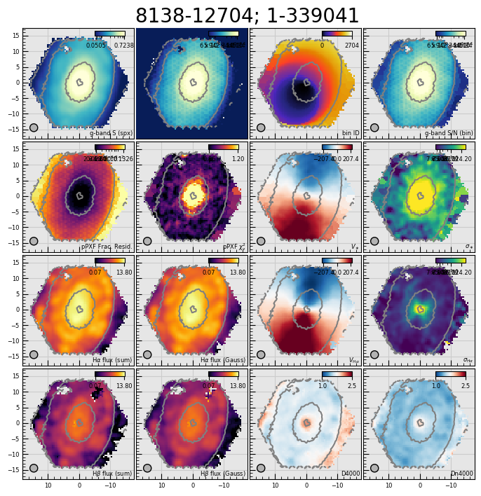

   A selection of maps from the ``MAPS`` file for quick assessment of
   the quality of the analysis. The ``PLATEIFU`` and MaNGA ID are
   given at the top of the figure. The panels show from top-to-bottom
   and left-to-right: :math:`g`-band-weighted mean flux
   (``SPX_MFLUX``), :math:`g`-band-weighted spaxel S/N (``SPX_SNR``),
   bin ID number (``BINID``), :math:`g`-band-weighted bin S/N
   (``BIN_SNR``), 68% growth of the fractional residual of the
   stellar-continuum (kinematics) fit (``STELLAR_FOM``; channel
   ``68th perc frac resid``), :math:`\chi^2_{\nu}` of the
   stellar-continuum (kinematics) fit (``STELLAR_FOM``; channel
   ``rchi2``), stellar velocity (``STELLAR_VEL``), (uncorrected)
   stellar velocity dispersion (``STELLAR_SIGMA``), non-parametric
   :math:`{\rm H}\alpha` flux (``EMLINE_SFLUX``; channel
   ``Ha-6564``), Gaussian-fit :math:`{\rm H}\alpha` flux
   (``EMLINE_GFLUX``; channel ``Ha-6564``), ionized-gas velocity
   (``EMLINE_GVEL``; channel ``Ha-6564``), (uncorrected) :math:`{\rm
   H}\alpha` emission-line velocity dispersion (``EMLINE_GSIGMA``;
   channel ``Ha-6564``), non-parametric :math:`{\rm H}\beta` flux
   (``EMLINE_SFLUX``; channel ``Hb-4862``), Gaussian-fit :math:`{\rm
   H}\beta` flux (``EMLINE_GFLUX``; channel ``Hb-4862``), D4000 index
   (``SPECINDEX``; channel ``D4000``), and the Dn4000 index
   (``SPECINDEX``; channel ``Dn4000``).

pPXF Results
~~~~~~~~~~~~

*Script*: ``$MANGADAP_DIR/bin/dap_ppxffit_qa``

*Output root*: ``$MANGA_SPECTRO_ANALYSIS/$MANGADRP_VER/$MANGADAP_VER/[DAPTYPE]/[PLATE]/[IFU]/qa``

*Output file*: ``manga-[PLATE]-[IFUDESIGN]-MAPS-[DAPTYPE]-ppxffit.png``

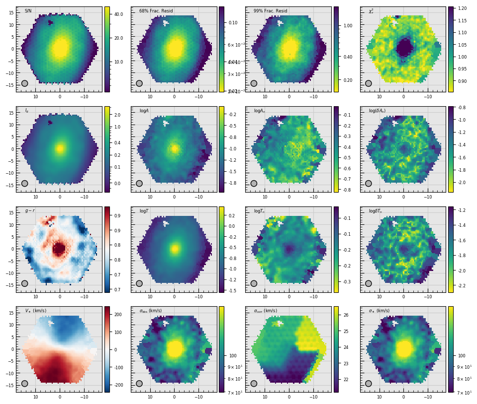

   Metrics used to assess the results of the fit to the stellar
   continuum performed by `ppxf`_ for the purpose of measuring the
   stellar kinematics (see :ref:`stellar-kinematics`). The plot
   includes a few non-trivial metrics: :math:`A` is the sum of the
   absolute value of the additive polynomial coefficients,
   :math:`A_n` is similarly computed as :math:`A` except that the
   coefficients have been normalized by the mean :math:`g`-band
   weighted flux, and :math:`\delta A_n` is the RMS of the polynomial
   coefficients with respect to their median. The metrics denoted as
   :math:`T`, :math:`T_n`, and :math:`\delta T_n` are similarly
   computed but using the template coefficients. These sets of
   metrics are meant to provide a sense of how strongly the additive
   polynomial coefficients and template mix vary across the galaxy.
   Strong variations likely indicate artifacts in the spectra that
   are throwing off the fit. The example shown here is typical. In
   detail, the panels show from top-to-bottom and left-to-right: The
   :math:`g`-band-weighted spaxel S/N, the 68% and 95% growth of the
   fractional residuals, the reduced :math:`\chi^2_{\nu}`, the
   :math:`g`-band-weighted mean flux, :math:`A`, :math:`A_n`,
   :math:`\delta A_n`, the :math:`g-r` color derived from the MaNGA
   datacube (see the ``GIMG`` and ``RIMG`` extensions in the DRP
   datacube), :math:`T`, :math:`T_n`, :math:`\delta T_n`, the stellar
   velocity field, the "observed" (i.e., uncorrected) stellar
   velocity dispersion field, the correction to apply to the stellar
   velocity dispersion to account for the resolution difference
   between the templates and the MaNGA spectra, and the corrected
   (astrophysical) stellar velocity dispersion.

Full-spectrum fit residuals
~~~~~~~~~~~~~~~~~~~~~~~~~~~

*Script*: ``$MANGADAP_DIR/bin/dap_fit_residuals``

*Output root*: ``$MANGA_SPECTRO_ANALYSIS/$MANGADRP_VER/$MANGADAP_VER/[DAPTYPE]/[PLATE]/[IFU]/qa``

*Output files*:

    * ``manga-[PLATE]-[IFUDESIGN]-LOGCUBE-[DAPTYPE]-sc-fitqa-maps.png`` (left)
    * ``manga-[PLATE]-[IFUDESIGN]-LOGCUBE-[DAPTYPE]-el-fitqa-maps.png`` (right)

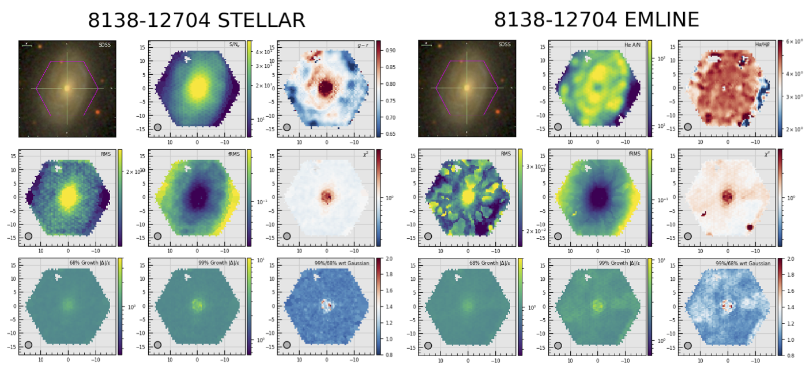

   Maps used to assess the quality of the stellar continuum fits
   (left) and the emission-line model fits (right). **Left**: The
   maps in the first two rows, top-to-bottom and left-to-right, are:
   the SDSS :math:`gri` image with a purple hexagon outlining the
   approximate size of the MaNGA IFU, the :math:`g`-band-weighted
   spaxel S/N, the :math:`g-r` color derived from the MaNGA datacube
   (see the ``GIMG`` and ``RIMG`` extensions in the DRP datacube),
   the RMS of the fit residuals, the RMS of the model-normalized
   residuals (i.e., the "fractional" RMS), and :math:`\chi^2_{\nu}`.
   The bottom row shows, from left-to-right the 68% and 99% growth of
   the error-normalized residuals and their ratio with respect to the
   expectation of a Gaussian. If the distribution of the
   error-normalized residuals strictly follow a Gaussian
   distribution, the spaxesl in the left, middle, and right maps
   should be 1, 2.6, and 1, respectively. Specifically for the
   right-most image in the bottom row, spaxels below 1 have a
   distribution of the fit residuals the falls more steeply than a
   Gaussian, whereas values larger than 1 imply a more peaked
   distribution (or at least one that has strong outliers). A more
   direct view of the distributions relative to a Gaussian are shown
   in the ``fitqa-growth`` plots below. **Right**: The maps in the
   bottom two rows are the same as shown for the stellar-continuum
   modeling. The middle and right-most plots in the top row, however,
   are the amplitude-to-noise ratio of the :math:`{\rm H}\alpha` line
   and the ratio of the :math:`{\rm H}\alpha` and :math:`{\rm
   H}\beta` fluxes.

----

*Output files*:

    * ``manga-[PLATE]-[IFUDESIGN]-LOGCUBE-[DAPTYPE]-sc-fitqa-lambda.png`` (left)
    * ``manga-[PLATE]-[IFUDESIGN]-LOGCUBE-[DAPTYPE]-el-fitqa-lambda.png`` (right)

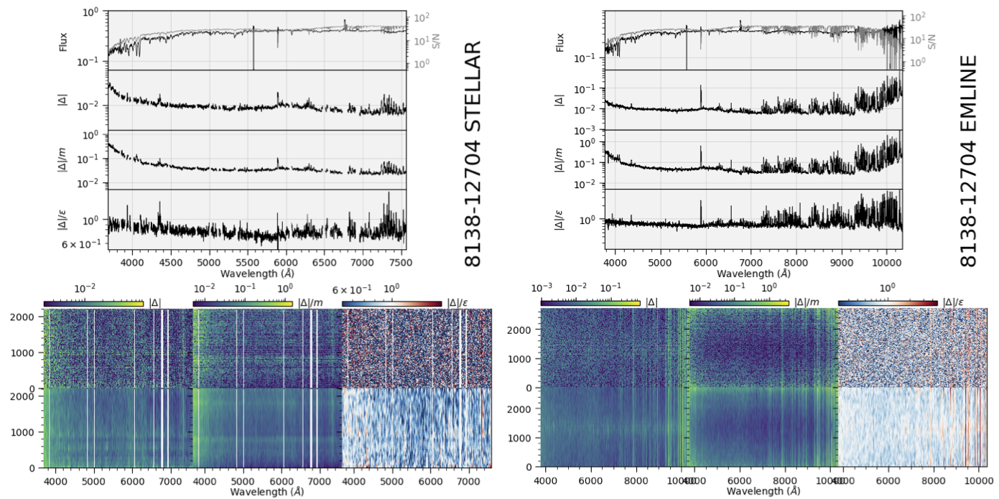

   The left and right panel groups are identical; the left panels are
   for the stellar-continuum-fitting module and the right panels are
   for the emission-line-fitting module. **Top**: The top group panels
   show, from top-to-bottom, the flux and S/N (gray) averaged over
   all fitted spectra, the residuals averaged over all spectra, the
   model-normalized residuals averaged over all spectra, and the
   error-normalized residuals over all spectra. These plots aim to
   highlight any spectral regions that are poorly fit for all
   spectra, on average. **Bottom**: Two-dimensional maps of the
   residuals where wavelengths are ordered along the abscissa and the
   fitted spectra are organized along the ordinate; the value along
   the ordinate is the bin ID number. The residuals are shown twice,
   the top rows shows them at their native values (within the limits
   of the plot resolution) and the bottom smooths the data spectrally
   by 100 pixels. Masked regions are shown in white (e.g.,
   emission-line regions in stellar-continuum fits in the left
   group). From left-to-right, the 2d images show the absolute value
   of the residuals (:math:`|\Delta|`), the model-normalized
   residuals, and the error-normalized residuals.
 
----

*Output files*:

    * ``manga-[PLATE]-[IFUDESIGN]-LOGCUBE-[DAPTYPE]-sc-fitqa-growth.png`` (left)
    * ``manga-[PLATE]-[IFUDESIGN]-LOGCUBE-[DAPTYPE]-el-fitqa-growth.png`` (right)

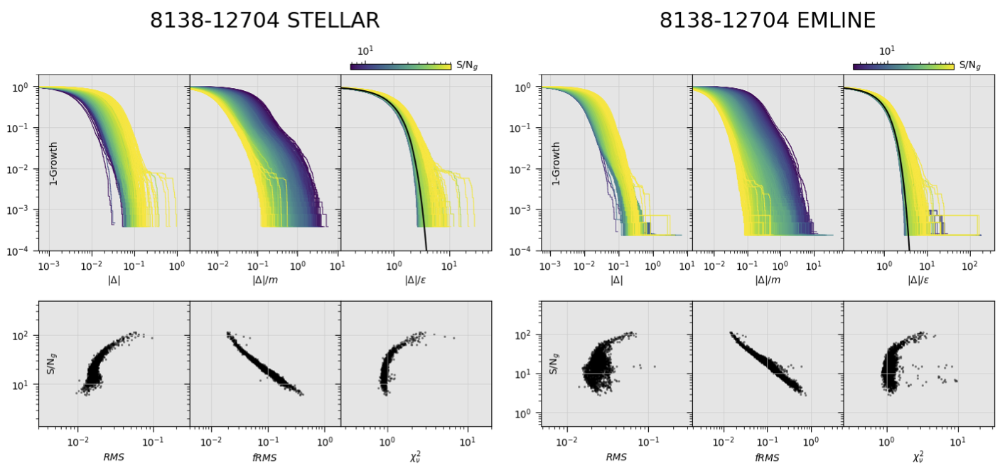

   The left and right panel groups are identical; the left panels are
   for the stellar-continuum-fitting module and the right panels are
   for the emission-line-fitting module. **Top**: The top row of panels
   shows the growth curves (or actually :math:`1-g(x)`) for the
   absolute value of the residuals, the model-normalized residuals,
   and the error-normalized residuals. One line is shown for each
   fitted spectrum; the lines are plotted from lowest to highest
   :math:`{\rm S/N}_g`. In the right-most panel, the black line shows
   the expectation for a Gaussian error distribution. **Bottom**: From
   left to-right, the RMS of the absolute value of the residuals, the
   RMS of the model-normalized residuals, and :math:`\chi^2_{\nu}`.

----

Aggregated per plate
--------------------

*Script*: ``$MANGADAP_DIR/bin/dap_plate_fit_qa``

*Output root*: ``$MANGA_SPECTRO_ANALYSIS/$MANGADRP_VER/$MANGADAP_VER/[DAPTYPE]/[PLATE]/qa``

*Output file*: ``[PLATE]-fitqa.png``

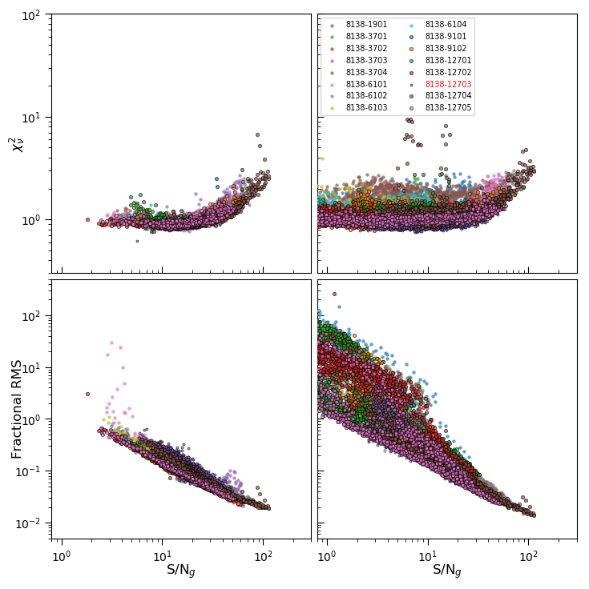

   Each point in these plots is the result of a full-spectrum fit to
   a single spectrum in either the stellar-kinematics (left column)
   or emission-line-fitting (right column) modules. This plot
   aggregates data from all observations on a given plate. The point
   types for each plotted observation are shown in the legend.
   Observations (``PLATEIFU``) numbers in red have been flagged by
   the DRP as having critical data-reduction issues (``CRITICAL``).
   Each panel shows a fit metric against the :math:`g`-band S/N of
   the spectrum. The top row shows the reduced chi-square and the
   bottom row show the RMS of the model-normalized residuals. Compare
   to Figure 27 from `Westfall et al. (2019, AJ, 158, 231)`_.

----

Aggregated per DAPTYPE
----------------------

*Script*: ``$MANGADAP_DIR/bin/dapall_qa``

*Output root*: ``$MANGA_SPECTRO_ANALYSIS/$MANGADRP_VER/$MANGADAP_VER/[DAPTYPE]/qa``

*Output file*: ``dapall_radialcoverage.png``

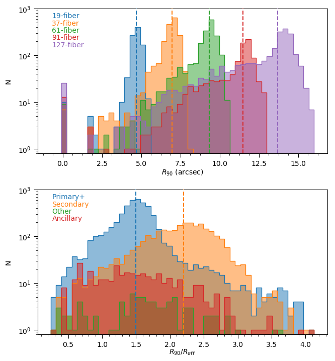

   The radius to which at least 90% of a 2.5 arcsecond elliptical
   annulus is covered by spaxels analyzed by the DAP, :math:`R_{90}`.
   The top panel shows the distribution of :math:`R_{90}` in
   arcseconds for observations taken with each bundle, colored by the
   bundle size. The bottom panel shows the distribution of
   :math:`R_{90}` normalized by the elliptical-Petrosian half-light
   radius, :math:`R_{\rm eff}`, for galaxies belonging to the
   Primary+ and Secondary samples, as well as observations of
   ancillary or filler targets.  Compare to Figure 28 from 
   `Westfall et al. (2019, AJ, 158, 231)`_.

----

*Output file*: ``dapall_redshift_dist.png``

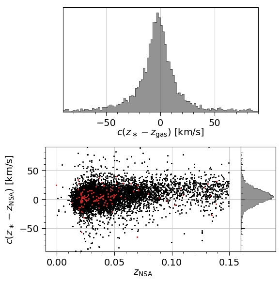

   The comparison of the bulk redshifts from the NASA-Sloan Atlas
   (NSA) and the bulk redshifts provided by the
   :ref:`metadatamodel-dapall`, where :math:`z_{\ast}` is from the
   ``STELLAR_Z`` column and :math:`z_{\rm gas}` is from ``HA_Z``. The
   bottom-left panel shows the scatter plot (one point per
   observations) with observations flagged as ``CRITICAL`` by the DRP
   in red. The gray histograms only use data from datacubes that are
   **not** flagged as ``CRITICAL``.

----

*Output file*: ``dapall_mass_vel.png``

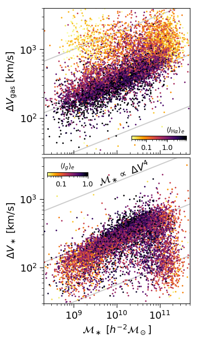

   NSA stellar mass versus the velocity gradient—defined as
   :math:`\Delta V = (V_{\rm hi} − V_{\rm lo})/(1 − (b/a)^2)^{1/2}`,
   where :math:`V_{\rm hi}` and :math:`V_{\rm lo}` are provided by
   the DAPall file based on the emission-line (top) and stellar
   (bottom) kinematics. Points are colored according to the mean
   surface brightness within 1 :math:`R_{\rm eff}`. Compare to Figure
   29 from `Westfall et al. (2019, AJ, 158, 231)`_.

----

*Output file*: ``dapall_mass_sigma.png``

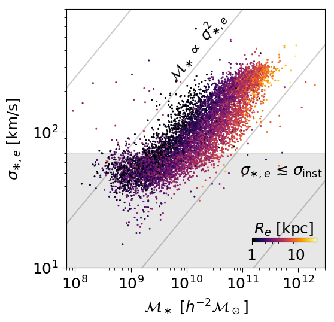

   NSA stellar mass versus the light-weighted stellar velocity dispersion
   within 1 :math:`R_{\rm eff}` from the DAPall file. Compare to Figure
   30 from `Westfall et al. (2019, AJ, 158, 231)`_.

----

*Output file*: ``dapall_ew_d4000.png``

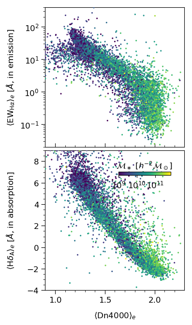

   Dn4000 versus the :math:`{\rm H}\alpha` equivalent width in
   emission (top) and the :math:`{\rm H}\delta A` index (equivalent
   width in absorption) after subtracting the best-fitting
   emission-line model. Points are colored by the NSA stellar mass.
   Compare to Figure 31 from `Westfall et al. (2019, AJ, 158, 231)`_.

----

*Output file*: ``dapall_mgfe_hbeta.png``

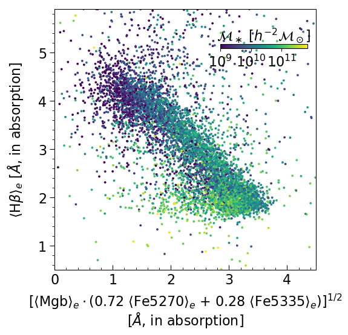

   Typical stellar-population age–metallicity diagnostic using the
   Mgb, Fe5270, Fe5335, and :math:`{\rm H}\beta` absorption indices.
   Points are colored by NSA stellar mass. Compare to Figure 32 from
   `Westfall et al. (2019, AJ, 158, 231)`_.

----

*Output file*: ``dapall_mass_lha.png``

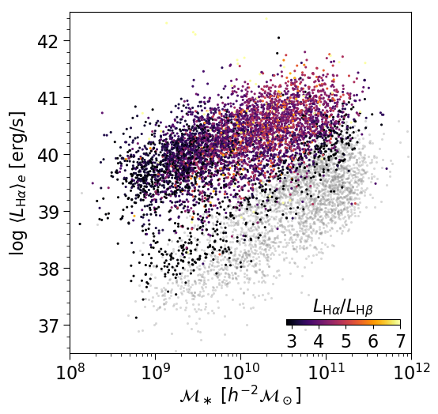

   NSA stellar mass versus the absolute luminosity in :math:`{\rm
   H}\alpha`. Points with :math:`{\rm H}\alpha` EW greater than 2
   |ang| are colored by the :math:`{\rm H}\alpha`-to-:math:`{\rm
   H}\beta` luminosity ratio; others are set to gray. Compare to
   Figure 33 from `Westfall et al. (2019, AJ, 158, 231)`_.

