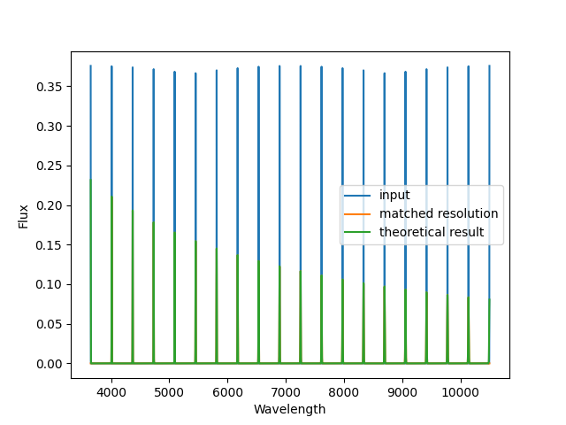
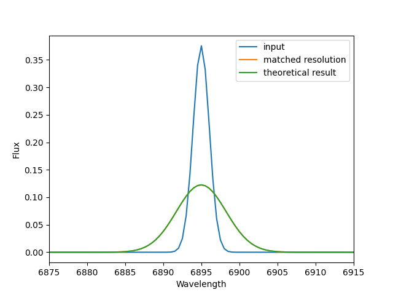

.. include:: include/links.rst

.. _resolution:

Spectral Resolution Matching
============================

When requested or required, the DAP will theoretically match the spectral
resolution of two spectra, assuming the known spectral is provided for both.
The primary function that does this is
:func:`~mangadap.util.resolution.match_spectral_resolution` and is largely a
wrapper of the ``ppxf.ppxf_util.gaussian_filter1d`` function provided by Michele
Cappellari in the `ppxf`_ package.

Here, we provide an example use of the function that demonstrates the accuracy
of the spectral resolution matching.  This is pulled from a unit test in
`test_resolution_matching.py
<https://github.com/sdss/mangadap/blob/master/mangadap/tests/test_resolution_matching.py>`__.

First, we build a fake spectrum with a set of Gaussian profiles evenly
distributed across the MaNGA wavelength range:

.. code-block:: python

    import numpy
    from mangadap.util.resolution import match_spectral_resolution
    from mangadap.util.constants import DAPConstants

    # Build a fake spectrum
    wave = numpy.arange(3650.0, 10501.0, 0.5)

    # Set the resolution to 2.5 angstroms
    fwhm = numpy.zeros(wave.shape, dtype=numpy.float64)
    fwhm += 2.5
    sigma = fwhm/DAPConstants.sig2fwhm
    sres = wave/fwhm

    # Set the flux to a set of uniform emission lines
    flux = numpy.zeros(wave.shape, dtype=numpy.float64)
    gc = numpy.linspace(wave[0], wave[-1], num=20)
    gs = sigma
    for c in gc:
        flux += numpy.exp(-0.5*numpy.square((wave - c)/gs))/numpy.sqrt(2.0*numpy.pi)/gs

    # Set the target spectral resolution
    new_sres = sres/3.0 + 2.0*sres[0]/3.0 + 300
    new_sres = sres-sres+900
    new_fwhm = wave/new_sres
    new_sigma = new_fwhm/DAPConstants.sig2fwhm

Given that we are convolving one set of Gaussian profiles with another set of
Gaussian profiles, we know exactly the Gaussian profiles that should result and
can compute the expected convolved spectrum directly:

.. code-block:: python

    # Set the flux to a set of uniform emission lines
    expected_flux = numpy.zeros(wave.shape, dtype=numpy.float64)
    gc = numpy.linspace(wave[0], wave[-1], num=20)
    for c in gc:
        expected_flux += numpy.exp(-0.5*numpy.square((wave - c)/new_sigma)) \
                                / numpy.sqrt(2.0*numpy.pi)/new_sigma

Finally, we match the spectral resolution of the input spectrum to the new
spectral resolution vector and compare the results.

.. code-block:: python

    # Match the resolution
    new_flux, matched_sres, sigma_offset, new_mask, _ = \
        match_spectral_resolution(wave, flux, sres, wave, new_sres, min_sig_pix=0.0)

The results are illustrated in the following two plots:

   A comparison of the original spectrum (blue) with the expected version after
   convolving to a lower spectral resolution (green) and the actual result of
   the convolution (orange).

   A zoom-in of the same plot, emphasizing that the green and oranges lines are
   virtually indistinguishable.

