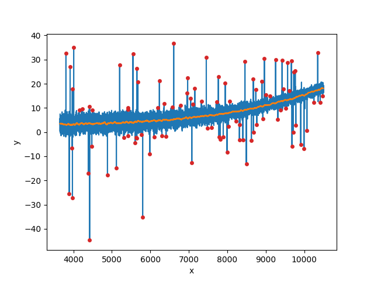

.. _smoothing:

Filtering Masked Arrays
=======================

Mostly for rejection of outlying flux values during spectral fitting, the DAP
implements a boxcar filtering class that allows for masked pixels and a local
calculation of the rms.  Although not as fast as other filtering algorithms
(e.g., ``scipy.ndimage``), these other routines (as far as I know) do not allow
for exclusion of masked pixels.

Here, we provide an example use of the function that demonstrates the accuracy
of the spectral resolution matching.  This is pulled from a unit test in
`test_filter.py
<https://github.com/sdss/mangadap/blob/master/mangadap/tests/test_filter.py>`__.

First, we build a fake spectrum with noise and a set of outliers.  The seed for
the noise is fixed so that the test is deterministic.

.. code-block:: python

    import numpy
    from mangadap.util.filter import BoxcarFilter

    rng = numpy.random.default_rng(1001)
    wave = numpy.arange(3650.0, 10501.0, 0.5)
    x = (wave - numpy.mean(wave))/(wave[-1]-wave[0])
    sig = 1/(0.5 + 0.5*(x+0.5)**2)
    flux = 3 + 0.1*x + 0.5*x**2 + 3*(x+1)**4
    dflux = rng.normal(scale=sig)
    indx = rng.integers(x.size, size=100)
    dflux[indx] += rng.normal(scale=10*sig)[indx]

Then I mask a few regions just for demonstration:

.. code-block:: python

    indx = ((wave > 4567) & (wave < 4587)) \
                | ((wave > 5567) & (wave < 5587)) \
                | ((wave > 9067) & (wave < 9087))
    sim = numpy.ma.MaskedArray(flux + dflux, mask=indx)

Finally I perform the filtering; see :class:`mangadap.util.filter.BoxcarFilter`.
Note that the class currently expects to perform the filtering on multiple
vectors simultaneously such that its attributes are two dimensional, even in
this 1D example.  The result of the filtering and the isolated outliers are
shown in the plot.

.. code-block:: python

    bf = BoxcarFilter(100, lo=3., hi=3., niter=None, y=sim, local_sigma=True)

    from matplotlib import pyplot
    pyplot.plot(wave, sim, zorder=1)
    pyplot.plot(wave, bf.smoothed_y[0], zorder=2)
    pyplot.scatter(wave[bf.output_mask[0]], sim[bf.output_mask[0]], marker='.', color='C3',
                   s=100, lw=0, zorder=3)
    pyplot.xlabel('x')
    pyplot.ylabel('y')
    pyplot.show()

   The input vector with heteroscedastic noise and outliers in blue, the
   smoothed vector in orange, and the identified (and rejected) outliers marked
   in red.  The :class:`mangadap.util.filter.BoxcarFilter` class is used by
   rejection iterations during the stellar kinematics fit.

