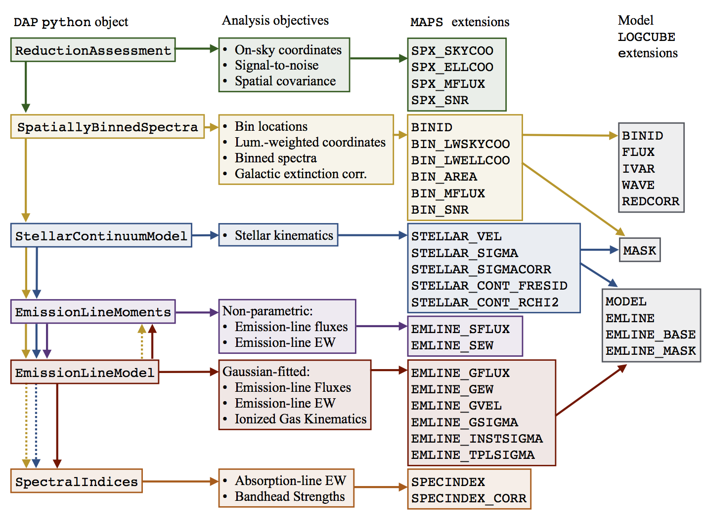

.. include:: include/links.rst

.. _workflow:

Data Analysis Pipeline Workflow
===============================

The following summarizes the DAP workflow when executed in the complete
analysis of a single MaNGA datacube.  This workflow is also described in
Section 4 of `Westfall et al. (2019, AJ, 158, 231)`_.

*Each* line in the :ref:`execution-analysis-plan` (i.e., each
``DAPTYPE``) defines how each of the six DAP modules is to analyze
the datacube. Figure 3 from the `Westfall et al. (2019, AJ, 158,
231)`_ provides a schematic of the diagram of the workflow, including
the primary python classes:

   Updated version of Figure 3 from `Westfall et al. (2019, AJ, 158,
   231)`_: Schematic diagram of the DAP workflow. From left-to-right,
   the schematic provides the relevant python modules, the analysis
   objectives of each module, and the associated ``MAPS`` and model
   ``LOGCUBE`` extensions generated by each module, as indicated by
   the arrows and colors. The python modules, contained within the
   named DAP python objects, are ordered from top to bottom by their
   execution order; an exception to this is that the emission-line
   moments are computed both before and after the emission-line
   modeling, as indicated by the two sets of arrows pointing toward
   the
   :class:`~mangadap.proc.emissionlinemoments.EmissionLineMoments`
   module. Arrow directions indicate the execution order and colors
   indicate the module dependencies. For example, the
   :class:`~mangadap.proc.emissionlinemoments.EmissionLineMoments`
   object depends on the results of both the
   :class:`~mangadap.proc.spatiallybinnedspectra.SpatiallyBinnedSpectra`
   object and the
   :class:`~mangadap.proc.stellarcontinuummodel.StellarContinuumModel`
   object. The dashed arrows indicate *conditional* dependencies. For
   example, the
   :class:`~mangadap.proc.emissionlinemodel.EmissionLineModel`
   deconstructs the bins in the hybrid-binning approach, such that
   the :class:`~mangadap.proc.spectralindices.SpectralIndices` are
   independent of the primary results of the
   :class:`~mangadap.proc.spatiallybinnedspectra.SpatiallyBinnedSpectra`.
   However, there is an explicit dependence of the
   :class:`~mangadap.proc.spectralindices.SpectralIndices` on the
   :class:`~mangadap.proc.spatiallybinnedspectra.SpatiallyBinnedSpectra`
   when the hybrid-binning approach is not used.

.. _workflow-analysis-modules:

Analysis Modules
----------------

The six main DAP modules and their purpose are:

 * :ref:`drp-redux-assessments`: Much of the DAP analysis is limited to
   spectra with sufficient S/N and spectral coverage. This first step
   determines the S/N in each spectrum and the fraction of the
   spectrum with valid pixels. The current approach uses the
   g-band-weighted S/N. Using the ``DONOTUSE`` and ``FORESTAR`` flags
   from the DRP, the DAP does not analyze any spectrum where fewer
   than 80% of the spectral channels are valid. This step also
   calculates the on-sky Cartesian and elliptical coordinates
   relative to the galaxy center; the elliptical coordinates are
   based on values in the input parameter files.

 * :ref:`spatial-binning`: The binning algorithm both determines which
   spaxels fall in each bin and then stacks the spectra in each bin.
   The DAP performs all spectral fitting on the binned spectra (termed
   as such even if a bin only contains a single spaxel) ''after'' they
   have been corrected for Galactic extinction.

 * :ref:`stellar-kinematics`: Once the spectra are binned, the DAP
   produces a model fit to the stellar continuum, primarily as a
   determination of the stellar kinamatics using `ppxf`_ (written by
   Michele Cappellari). Currently, the DAP uses the ``MILESHC``
   library --- see Section 5 of `Westfall et al. (2019, AJ, 158,
   231)` --- during this fit and only measures the first two moments
   (:math:`V` and :math:`\sigma`). The fit is performed with the
   templates and MaNGA data at their respective (and different)
   spectral resolutions, such that the velocity dispersions must be
   corrected for the resolution difference between the templates and
   the MaNGA data. Understanding these :ref:`corrections` and how to
   apply them are a critical part of using the stellar velocity
   dispersions.
   
 * *Emission-line Measurements*:  Once the stellar-continuum fit has
   been performed, the DAP makes various measurements of the nebular
   emission lines.  Any region beyond the spectral range of the fitted
   templates will *not* include an analysis of the emission lines.  The
   DAP performs two sets of emission-line measurements, one based on
   simple moments of the line profile and a second based on a Gaussian
   fit:

    * :ref:`emission-line-moments`: We provide total flux and
      equivalent-width measurements based on direct summation of the
      flux over predescribed rest wavelength bands, accounting for any
      continuum found in sidebands to the blue and red of each emission
      line.

    * :ref:`emission-line-modeling`:  We also simultaneously fit the
      stellar continuum and a set of emission lines, assuming a single
      Gaussian component for each line.  All line velocities are forced
      to be the same, we tie the velocity dispersions of neighboring
      doublets, and we tie the fluxes of doublets that should be fixed
      quantum mechanically.  These fits provide total fluxes and
      equivalent widths, which can be compared with the direct summation
      results, as well as fitted velocities and velocity dispersions.
      The fitted velocity dispersions must be corrected for the
      instrumental resolution at the observed wavelength of the line;
      the :ref:`corrections` and their application to the data are
      similar to the corrections for the stellar velocity dispersions.

 * :ref:`spectral-index-measurements`: Finally, spectral indices are
   measured after subtracting the best-fitting emission-line model from
   each spectrum.  Measurements include both absorption-line (equivalent
   widths compared to two sidebands) and bandhead (the color of the
   spectrum based on two passbands) indices.  The measurements are
   performed at the native MaNGA spectral resolution and
   :ref:`corrections` are provided that should effectively set the
   measurement to a :math:`\sigma=0` spectrum. 

.. toctree::
   :maxdepth: 1

   modules/rdx.rst
   modules/bin.rst
   modules/stellarkin.rst
   modules/emissionmom.rst
   modules/emissionfit.rst
   modules/indices.rst

Output Files
------------

The DAP provides files for each combination of ``PLATEIFU`` and
``DAPTYPE`` that are successfully analyzed and a summary table with
salient properties, as described by the :ref:`datamodel` and
:ref:`metadatamodel`, respectively.

The two primary output files, the :ref:`datamodel-maps` and the
:ref:`datamodel-cube` are constructed using the reference files that are
produced by each many analysis module.

 * :ref:`maps-construction`: The ``MAPS`` file provides 2D "maps" (i.e.,
   images) of DAP measured properties. The shape and WCS of these images
   identically matches that of a single wavelength channel in the
   corresponding DRP ``LOGCUBE`` file.
 * :ref:`cube-construction`: The DAP model ``LOGCUBE`` files provide the
   binned/unbinned spectra and the best-fitting model spectra for all
   spectra that were successfully fit; again the shape of the cube
   identically matches the DRP ``LOGCUBE`` file.

The DAP table, the :ref:`metadatamodel-dapall`, provides global
properties extracted from the MaNGA data that can be used in, e.g.,
sample selection. Much of the information in this file is simply
pulled from the headers of the output ``MAPS`` or model ``LOGCUBE``
files. However, some quantities are produced uniquely for this file.
The :ref:`dapall-construction` is performed after all the
``PLATEIFU``-``DAPTYPE``-specific files have been produced for a
given run.

.. toctree::
   :maxdepth: 1

   modules/makemaps.rst
   modules/makecube.rst     
   modules/makedapall.rst   

